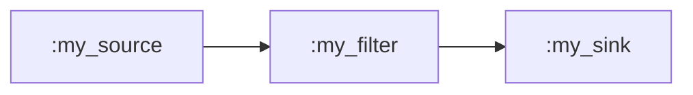
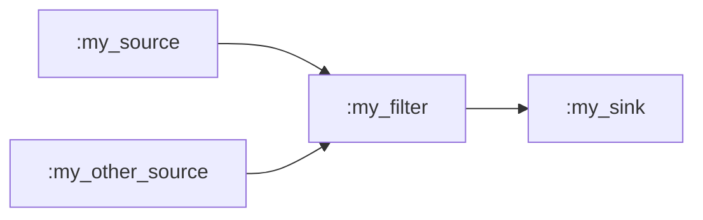

# Chapter 1 - Codecs, containers and pipelines

In this chapter you'll learn the essentials about codecs and containers
and how to build Membrane pipelines. You will then implement a simple pipeline
by yourself.

## Theory overview

TODO

## The task
Your task is to create a pipeline that will read audio from an MP3 file,
VP8 video from an IVF file, transcode them into AAC and H264 respectively, and
mux them into a single MP4 container file.

Woah, that's a mouthful of abbreviations and acronyms with numbers in them! 
Let's go over the process step by step.

### The process

You have access to two media files - one with audio, the other with video: 
- `assets/input_video.ivf` - **IVF** (Indeo Video Format) is a simple container 
  format for storing video. It supports multiple multiple codecs, and the video 
  stored in this one is encoded with **VP8** - an open and royalty-free video coding format. 
- `assets/input_audio.mp3` - **MP3** is an audio coding format. It doesn't need to be
payloaded to a separate container, the encoded stream can just be put into a file directly.

The first step is to read the media from those files to get the streams flowing through the 
pipeline. The MP3 audio stream can already be decoded as it was read from the file, but 
the VP8 video stream needs a bit of help. The stream we read from the file is encapsulated
in an IVF container. Only once the video is extracted from this container, it will be a plain 
VP8 stream, which can be decoded. Once you have both streams ready, decode them into raw
audio and video using decoders appropriate for these formats.

These raw streams can then be encoded into our target formats using encoders: 
- **H.264** - also known as AVC (Advanced Video Coding) - A video coding format, 
  by far the most commonly used format in the industry. 
- **AAC** (Advanced Audio Coding) - An audio coding format, widely supported in the
  industry, designed to be the successor of MP3.

The process of converting from one coding format to another is called
_transcoding_. Here we achieve it by decoding a stream and then immediately
encoding it with a different codec.

Now you should have access to two streams, encoded with our desired formats. Now
let's merge them, so that they are synchronized and can be interpreted as two 
interleaved tracks of a single multimedia stream. This process is called
_muxing_ (shortened from multiplexing), and here you will mux your audio and video
streams into an **MP4** container. MP4 is a container format most commonly used for 
storing video and audio, but can also be used to store other data, such as subtitles. 

The muxed stream is now ready to be put into a file. The container format
ensures that anything reading from the file will be able to separate (_demux_)
included tracks into distinct, synchronized streams. For example, the thing
reading from the file can be a media player, which needs to play both video and
audio track alongside each other.

### Building blocks

Okay, you know _what_ you need to do. Now let's explore _how_ to do it.

As you probably deduced from the theoretical introduction to Membrane, you'll
need to construct a pipeline from components that will performs the actions
described above. Packages that provide Membrane components are called _plugins_,
and they group components associated with a similair field together. For example, 
`:membrane_mp4_plugin` supplies all the components for muxing and demuxing MP4 containers. 

Normally you would need to figure out what plugins have the components you need - 
a looong list of all our packages can be found in
[`membrane_core`'s README](https://github.com/membraneframework/membrane_core#all-packages)
or on `membrane_core`'s [hexdocs](https://membrane-core.hexdocs.pm/00_general.html), in the
_Packages in our ecosystem_ section. For the sake of this workshop, we already
added the necessary deps to this project:

```elixir
  defp deps do
    [
      # Chapter 1 deps
      {:membrane_core, "~> 1.3"},
      {:membrane_file_plugin, "~> 0.17.3"},
      {:membrane_ivf_plugin, "~> 0.9.0"},
      {:membrane_transcoder_plugin, "~> 0.4.0"},
      {:membrane_mp4_plugin, "~> 0.36.9"},
      ...
    ]
```

Let's quickly go over them and what components will be relevant to us:
- `:membrane_core` - The main package of the framework - all other packages
  depend on it. It implements all functionalities that make the framework work.
- `:membrane_file_plugin` - Plugin that provides components for reading and
  writing to files: 
  * `Membrane.File.Source` - Element that reads chunks of raw bytes from a given
    file, puts them into buffers and sends them along 
  * `Membrane.File.Sink` - Element that writes received chunks of data to a
    file.
- `:membrane_ivf_plugin` - Plugin that provides components for dealing with IVF
  containers: 
  * `Membrane.IVF.Deserializer` - Element that receives a stream with an IVF
    container and outputs the stream extracted from the container.
- `:membrane_transcoder_plugin` - A real workhorse - plugin that provides a
  single, yet really powerful element:
  * `Membrane.Transcoder` - This element is a bin that is capable of transcoding 
    the input audio or video stream into a desired format specified with simple 
    declarative API. This will spare you from the task of:
    - manually ensuring the stream is suited for the decoder, 
    - setting up the decoder, 
    - ensuring the raw video is suited for the encoder, 
    - setting up the encoder,
    - ensuring the encoded output is suitable for MP4 muxing.
    Instead, you'll only need to specify the output format, and the Transcoder
    will handle the machinery itself.
- `:membrane_mp4_plugin` - Plugin that provides components for muxing and 
  demuxing MP4 containers:
  * `:Membrane.MP4.Muxer.ISOM` - An element that takes in a single or multiple
    input streams and muxes them into an MP4 container, ready to be saved to a
    file.

That's all the components needed for this task. Time to put those pieces together!

### Building the pipeline

To create an empty pipeline you can call 

```bash
mix membrane.gen.pipeline MyPipeline
```

This will create `my_pipeline.ex` file in `lib/` directory and inside it a
skeleton of a pipeline, with the main module being called `MyPipeline`. Don't get
intimidated by the amount of generated comments, they're mostly optional
callbacks, useful only in specific circumstances. Everything you'll need for
this task can be done inside `handle_init/2` callback - it executes when the
pipeline is created.

Behavior of a callback is mostly controlled by what _actions_ it returns. List
of all actions a pipeline can execute can be found 
[here](https://membrane-core.hexdocs.pm/Membrane.Pipeline.Action.html#t:t/0), 
but for our use case you'll only need the 
[`spec` action](https://membrane-core.hexdocs.pm/Membrane.Pipeline.Action.html#t:spec/0).
This action is used to spawn components and specify how they will be organized
once it's executed. A detailed description how to define the topology of these
components can be found 
[in the documentation of `ChildrenSpec` module](https://membrane-core.hexdocs.pm/Membrane.ChildrenSpec.html), 
but you'll need only a small subset of available functionalities.

To create a 'start' of a pipeline, [`child/2`](https://membrane-core.hexdocs.pm/Membrane.ChildrenSpec.html#child/2) function is used:

```elixir
spec = 
  [
    child(:my_source, MySource)
  ]
```

The first argument is the name that this element will have, and the second 
one is the module that implements it. The first element in a pipeline
needs to be a [Source](https://membrane-core.hexdocs.pm/Membrane.Source.html),
a type of element that can only have outputs.
This function will return a [`builder`](https://membrane-core.hexdocs.pm/Membrane.ChildrenSpec.html#t:builder/0),
which can be then passed to a [`child/3`](https://membrane-core.hexdocs.pm/Membrane.ChildrenSpec.html#child/3) call:

```elixir
spec = 
  [
    child(:my_source, MySource)
    |> child(:my_filter, MyFilter)
  ]
```

With arguments being analogous. [Filters](https://membrane-core.hexdocs.pm/Membrane.Filter.html)
are components that have both inputs and outputs, and therefore are usually 
the most common components of pipelines. 

When two children of a pipeline are defined like that, with the builder returned
from defining the first one being passed to the definition of the second one, these
children will be _linked_. The things through which components connect to each
other are [_pads_](https://membrane-core.hexdocs.pm/pads.html). They can be
thought of as connectors between components - they need to be compatible, and if
they are, media will flow through them.

But this pipeline won't work - `MyFilter` is a filter, so it also has output
pads, which can't just be disconnected - a pipeline cannot have any 'dangling'
pads. We need to add a component which will finish off the pipeline - a
[`Sink`](https://membrane-core.hexdocs.pm/Membrane.Sink.html). Components of 
this type have only input pads.

```elixir
spec = 
  [
    child(:my_source, MySource)
    |> child(:my_filter, MyFilter)
    |> child(:my_sink, MySink)
  ]
```

When a spec like this is returned with a `:spec` action,
three children will be spawned - `:my_source`, `:my_filter` and `:my_sink`, with the source's
output pad linked to the filter's input pad, and the filter's
output pad linked to the sink's output pad:



But what if our filter supports multiple input pads, and we want to link
something else to it? There is a reason `spec` is a list - multiple 'branches'
of a pipeline can be defined this way. To refer to an already defined child you
can use [`get_child/2`](https://membrane-core.hexdocs.pm/Membrane.ChildrenSpec.html#get_child/2)
(or [`get_child/1`](https://membrane-core.hexdocs.pm/Membrane.ChildrenSpec.html#get_child/1) if it's a source):

```elixir
spec = 
  [
    child(:my_source, MySource)
    |> child(:my_filter, MyFilter)
    |> child(:my_sink, MySink),
    child(:my_other_source, MySource),
    |> get_child(:my_filter)
  ]
```

Now the pipeline will look like this:



With this introduction you now have all the necessary tools to create your
pipeline to finish your task. The pipeline will be a bit more complex than the
shown examples, but not by much. You need to figure out how the components you
choose will be connected and return a `spec` action reflecting the pipeline you
designed.

## **BONUS** Task

If you managed to finish the main task and are up for a challenge, then this
BONUS task is for you.

It's really simple - reverse the pipeline you implemented. Transform an MP4 file
with H264 and AAC tracks into an IVF file with VP9 and an MP3 file. You'll need
a few more elements that weren't mentioned, but that shouldn't be a problem for
a pro like you.

## **BONUS** **B O N U S** Task

Woah, you're good. Hopefully this one will stop you, because we don't have any
more. 

Your BONUS BONUS task is to extend the pipeline from BONUS task and add support
for MP4's with any number of H264 and AAC tracks - each one should end up in
a separate IVF or MP3 file. 

<details>
<summary><b>How am I supposed to know what is in the MP4?</b></summary>

`:new_tracks` notification will be your ally - see the 
[Demuxer's documentation](https://membrane-mp4-plugin.hexdocs.pm/Membrane.MP4.Demuxer.ISOM.html) for details
</details>

<details>
<summary><b>Okay, I now know what's in the MP4, but how to link the Demuxer further?</b></summary>

Familiarize yourself with the concept of [Dynamic pads](https://membrane-core.hexdocs.pm/pads.html#dynamic-pads)
</details>
