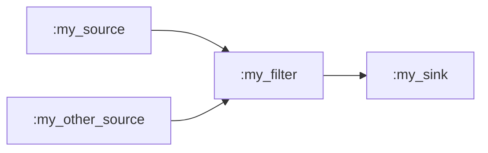

# Chapter 1 - Codecs, containers and pipelines - TLDR

README goes over everything in detail - this file will be more concise 
and won't explain everything step by step. If you feel like you understand
everything needed for this chapter then this version should suffice, however if
you are ever unsure about something, it's probably explained in the README.

## Task
Your task is to create a pipeline that will read audio from an MP3 file,
VP8 video from an IVF file, transcode them into AAC and H264 respectively, and
mux them into a single MP4 container file.

### The process

The process your pipeline will implement looks like this:
- Get audio stream:
  1. Read a MP3 audio stream from `assets/input_audio.mp3`,
  2. Transcode the audio stream from MP3 to AAC,
- Get video stream: 
  1. Read an IVF container from `assets/input_video.ivf`,
  2. Extract a VP8 video stream from the container,
  3. Transcode the video stream from VP8 to H264,
- Mux the AAC audio stream and H264 video stream into an MP4 container.
- Save the MP4 container to a file.

### Building blocks


| Component | Description |
|-----------|-------------|
| `Membrane.File.Source` | Reads chunks of raw bytes from a given file, puts them into buffers and sends them along | 
| `Membrane.File.Sink` | Writes received chunks of data to a file. | 
| `Membrane.IVF.Deserializer` | Receives a stream with an IVF container and outputs the stream extracted from the container. |
| `Membrane.Transcoder` | A powerful component capable of transcoding the input audio or video stream into a desired format specified with a simple declarative API. | 
| `Membrane.MP4.Muxer.ISOM` | Takes in a single or multiple input streams and muxes them into an MP4 container, ready to be saved to a file. |


### Pipelines

The arrangement of components building a pipeline is determined by returning a
[`:spec`](https://membrane-core.hexdocs.pm/Membrane.Pipeline.Action.html#t:spec/0)
action from one of Pipeline's callbacks. This action needs to contain a definition of
what components should be spawned and how they should be linked, which is
expressed by a handful of functions:

To create a 'start' of a pipeline the first component has to be a Source and
[`child/2`](https://membrane-core.hexdocs.pm/Membrane.ChildrenSpec.html#child/2) 
function is used. To link the source with a filter, pass the returned 
[`builder`](https://membrane-core.hexdocs.pm/Membrane.ChildrenSpec.html#t:builder/0)
to a [`child/3`](https://membrane-core.hexdocs.pm/Membrane.ChildrenSpec.html#child/3) call.
Finally the pipeline needs to be finished off with a sink.

If a component has multiple inputs or outputs and you want to link something to it after you've already defined it, 
you can refer to it by it's name with
[`get_child/2`](https://membrane-core.hexdocs.pm/Membrane.ChildrenSpec.html#get_child/2)
(or [`get_child/1`](https://membrane-core.hexdocs.pm/Membrane.ChildrenSpec.html#get_child/1) if it's a source).

Last thing. Almost all components define _options_, which can be passed when they're
created. To do that, pass a component's struct instead of a module in `child/2` and
`child/3` functions.

An example pipeline can be defined like this:

```elixir
spec = 
  [
    child(:my_source, %MySource{some_element_option: :some_value})
    |> child(:my_filter, MyFilter)
    |> child(:my_sink, MySink),
    child(:my_other_source, MySource)
    |> get_child(:my_filter)
  ]
```

The resulting structure will look like this:



To materialize the defined structure it needs to be returned in a `:spec`
action:

```elixir
@impl true
def handle_init(_ctx, _opts) do # this can be any callback
  spec = ...
  {[spec: spec], %{}}
end
```

### Building the pipeline

To create an empty pipeline you can call

```bash
mix membrane.gen.pipeline WorkshopPipeline
```

In `handle_init/2` you can define the pipeline that will do what you want and
bring it to life with 
[`:spec`](https://membrane-core.hexdocs.pm/Membrane.Pipeline.Action.html#t:spec/0) action.

Last thing to do is to handle termination of the pipeline with 
[`handle_element_end_of_stream/4`](https://membrane-core.hexdocs.pm/Membrane.Pipeline.html#c:handle_element_end_of_stream/4)
callback and 
[`:terminate`](https://membrane-core.hexdocs.pm/Membrane.Pipeline.Action.html#t:terminate/0)
action:

```elixir
@impl true
def handle_element_end_of_stream(:last_element_name, _pad, _ctx, state) do
  {[terminate: :normal], state}
end

@impl true
def handle_element_end_of_stream(_element, _pad, _ctx, state) do
  {[], state}
end
```

If everything's set, the pipeline can be run with `mix run run_pipeline.exs`.
