# Multimedia with Membrane 101

Goatmire 2026 · Workshop

<div class="abs-br m-6 text-sm opacity-70">
  Software Mansion
</div>

---
layout: default
---

# Table of contents

Four chapters. Each one starts with a bit of theory, then you build.

<div class="toc">
  <Link to="chapter-1">
    <span class="num">CHAPTER 1</span>
    <span class="name">Codecs, containers and pipelines</span>
  </Link>
  <Link to="chapter-2">
    <span class="num">CHAPTER 2</span>
    <span class="name">Raw video processing and custom Elements</span>
  </Link>
  <Link to="chapter-3">
    <span class="num">CHAPTER 3</span>
    <span class="name">Timestamps and flow control</span>
  </Link>
  <Link to="chapter-4">
    <span class="num">CHAPTER 4</span>
    <span class="name">Real-time streaming with WebRTC</span>
  </Link>
</div>

---
layout: default
---

# How the workshop works

<v-clicks>

- **One project**, built from the ground up. Every chapter extends the previous one.
- **Repo**: `github.com/membraneframework-labs/membrane_workshop_at_goatmire_2026`
- **Materials** live in `materials/Chapter N/`, in two flavours:
  - `README.md`: concise task and building blocks
  - `DEEP_DIVE.md`: the theory explained, task walked through step by step
- **Bonus tasks**: some chapters also have a `BONUS_TASKS.md` for those who finish early
- **Checkpoint branches**: `chapter-1-checkpoint` … `chapter-4-checkpoint` hold our solutions. Fall back on them if something goes sideways.

</v-clicks>

<v-click>

```bash
git clone https://github.com/membraneframework-labs/membrane_workshop_at_goatmire_2026.git
cd membrane_workshop_at_goatmire_2026
mix deps.get
```

</v-click>

---
layout: section
routeAlias: chapter-1
---

<span class="chapter-label">Chapter 1</span>

# Codecs, containers and pipelines

Reading, transcoding and muxing media with a Membrane pipeline

---
layout: default
---

# What's in this chapter

<v-clicks>

1. **Codecs**: why raw media doesn't fit anywhere
2. **Containers**: how encoded streams are stored and shipped
3. **Transcoding**, **muxing** and **demuxing**
4. **Membrane**: components, pads, plugins
5. **Pipelines**: describing a graph of components in code
6. **The task**: MP3 + IVF in, MP4 out

</v-clicks>

---
layout: default
---

# Codecs

Raw media is huge. 1080p video at 30 fps, 3 bytes per pixel:

<div class="text-center text-3xl my-4 font-semibold" style="color: var(--membrane-navy)">
1920 × 1080 × 3 × 30 ≈ 187 MB per second
</div>

<v-click>

A **codec** is a pair of algorithms: an **encoder** compresses raw media into a coding format,
a **decoder** turns it back into raw frames or samples.

</v-click>

<v-click>

<div class="grid grid-cols-2 gap-6 mt-4">
<div>

**Video**

- **VP8**: open, royalty-free. Our input.
- **H.264 / AVC**: by far the most used video format in the industry. Our output.

</div>
<div>

**Audio**

- **MP3**: the classic. Our input.
- **AAC**: designed as the successor of MP3, widely supported. Our output.

</div>
</div>

</v-click>

---
layout: default
---

# Containers

An encoded stream is just bytes. A **container** wraps it with what a reader needs:
where each frame starts, its timestamp, which track it belongs to.

<v-clicks>

- **IVF**: a very simple container for a single video stream (VP8, VP9, AV1). Our input video lives in one.
- **MP4**: the container you meet everywhere. Many tracks: video, audio, subtitles. Our output.
- **MP3**: no container needed. The encoded stream can go straight into a file.

</v-clicks>

<v-click>

<div class="mt-6 grid grid-cols-2 gap-6">
<div>

<span class="pill">Codec</span> *how* the media is compressed

</div>
<div>

<span class="pill light">Container</span> *how* the streams are packaged

</div>
</div>

</v-click>

---
layout: default
---

# Encoding, decoding, transcoding

**Decoding** turns a coded stream into raw media, **encoding** does the reverse.
**Transcoding** converts one coding format to another.
Dashed shapes are streams, solid boxes are elements that process them.

<div class="flex justify-center">

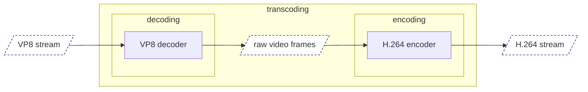

</div>

<v-click>

<div class="-mt-2 mb-1">The same for audio:</div>

<div class="flex justify-center">

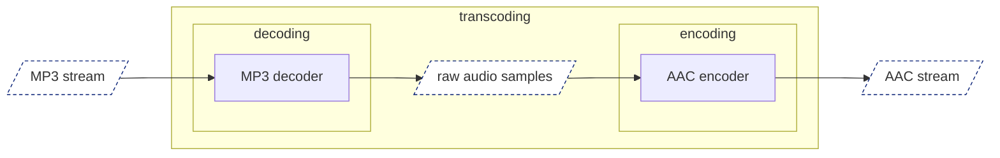

</div>

</v-click>

<v-click>

In the middle you hold **raw** media. That's where you can look at it, change it, or play it.

</v-click>

---
layout: default
---

# Muxing and demuxing

<div class="grid grid-cols-2 gap-8">
<div>

**Muxing** (multiplexing)

Merge several streams into one, interleaved and synchronized.

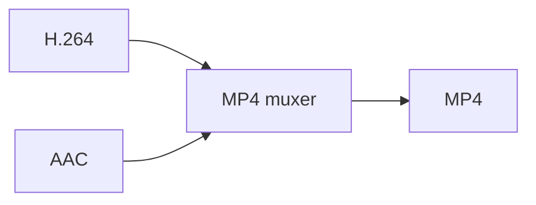

</div>
<div v-click>

**Demuxing**

The reverse. Whatever reads the stream, like a media player, splits it back into distinct, synchronized streams.

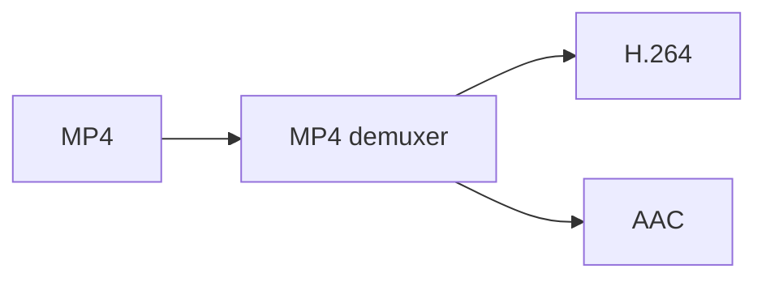

</div>
</div>

---
layout: default
---

# Membrane in one slide

<v-clicks>

- A multimedia framework written in **Elixir**.
- A **pipeline** is a graph of **components** that media flows through.
- Every component is an Erlang process.
- Components connect through **pads**. Pads must be compatible for media to flow.
- `membrane_core` is the engine. Components are shipped in **plugins**, one per domain: files, MP4, H.264, WebRTC…

</v-clicks>

---
layout: default
---

# Three kinds of components

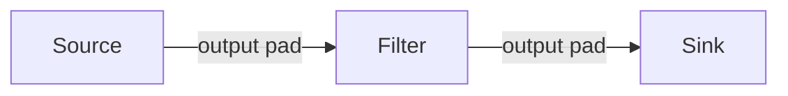

<div class="grid grid-cols-3 gap-6 mt-8">
<div v-click>

**Source**

Only **output** pads. The start of a pipeline: reads a file, captures a camera, receives from the network.

</div>
<div v-click>

**Filter**

**Input and output** pads. The most common kind: decoders, encoders, parsers, muxers, your own processing.

</div>
<div v-click>

**Sink**

Only **input** pads. The end of a pipeline: writes a file, plays on screen, sends over the network.

</div>
</div>

<v-click>

<div class="mt-6">

A pipeline cannot have **dangling pads**. Every output must be linked to an input.

</div>

</v-click>

---
layout: default
---

# Plugins for this chapter

Already in `mix.exs`.

```elixir
{:membrane_core, "~> 1.3"},
{:membrane_file_plugin, "~> 0.17.4"},
{:membrane_ivf_plugin, "~> 0.9.0"},
{:membrane_transcoder_plugin, "~> 0.5.0"},
{:membrane_mp4_plugin, "~> 0.36.9"}
```

---
layout: default
---

# Pipelines: callbacks and actions

A pipeline is a module. Membrane calls its **callbacks**, the callbacks return **actions**.

```elixir {all|1|3-4|5|6|all}
defmodule WorkshopPipeline do
  use Membrane.Pipeline

  @impl true
  def handle_init(_ctx, _opts) do
    {[spec: spec], %{}}
  end
end
```

<v-clicks at="1">

- `handle_init/2` runs when the pipeline is initialized
- returns `{actions, state}`
- the `:spec` action spawns children and links them

</v-clicks>

---
layout: default
---

# Describing a pipeline: `child`

`child/2` starts a chain, `child/3` extends it. Name first, module or struct second.

<div class="grid grid-cols-2 gap-6">
<div>

```elixir
spec = [
  child(:my_source, MySource)
  |> child(:my_filter, MyFilter)
  |> child(:my_sink, MySink)
]
```

</div>
<div>

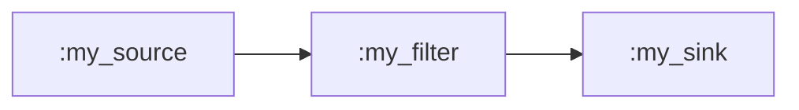

</div>
</div>

<v-clicks>

- Piping the **builder** from one `child` into the next **links** them: output pad to input pad.
- The chain starts with a **Source** and must end with a **Sink**.

</v-clicks>

---
layout: default
---

# Branching: `get_child`

`spec` is a list. Each element is a branch.

<div class="grid grid-cols-2 gap-6">
<div>

```elixir
spec = [
  child(:my_source, MySource)
  |> child(:my_filter, MyFilter)
  |> child(:my_sink, MySink),

  child(:my_other_source, MySource)
  |> get_child(:my_filter)
]
```

</div>
<div>

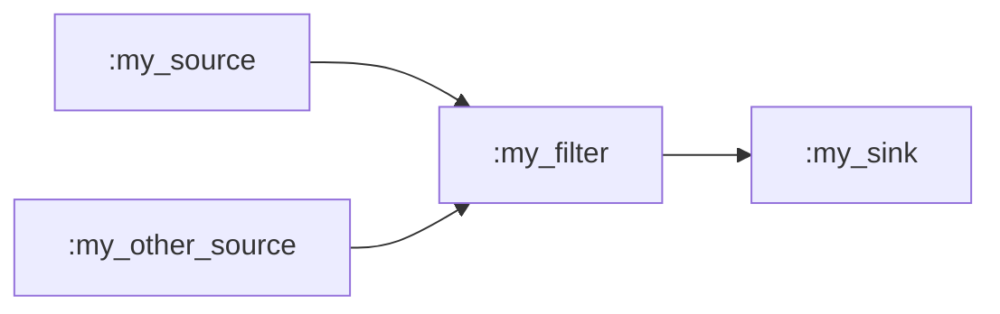

</div>
</div>

---
layout: default
---

# Choosing pads: `via_in` and `via_out`

Components can have several pads, and pads can take **options**.

```elixir {all|3|3-4|all}
spec = [
  child(:my_source, MySource)
  |> via_out(:some_output, options: [some_pad_option: :some_value])
  |> child(:my_filter, MyFilter)
]
```

<v-clicks at="1">

- link `:my_source`'s pad named `:some_output`, not the default one
- and set its `:some_pad_option` to `:some_value`

</v-clicks>

<v-click>

`via_in/3` does the same for the input side. Without them, the default pads `:output` and `:input` are used.

</v-click>

---
layout: default
---

# Configuring components

Almost every component has **options**. Pass a struct instead of a module.

```elixir
spec = [
  child(:my_source, %MySource{some_element_option: :some_value})
  |> ...
]
```

<v-click>

Available options are listed in each component's docs. Two you'll need today:

- `Membrane.File.Source` has `:location` and `:content_format`
- `Membrane.Transcoder` takes `:output_stream_format` as an option of its `:output` pad, so it goes through `via_out`

</v-click>

---
layout: default
---

# Bringing it to life

Actions are executed when a callback returns them.

```elixir
@impl true
def handle_init(_ctx, _opts) do
  spec = [
    child(:source, %Membrane.File.Source{location: "assets/bbb.mp3"})
    |> ...
  ]

  {[spec: spec], %{}}
end
```

<v-click>

When `handle_init/2` returns, the children are spawned and linked exactly as described in `spec`. Media starts to flow.

</v-click>

---
layout: default
---

# Knowing when to stop

The pipeline doesn't know when its job is done. You do: when the **last** component gets **end of stream**.

```elixir {all|1-4|6-9|all}
@impl true
def handle_element_end_of_stream(:last_element_name, _pad, _ctx, state) do
  {[terminate: :normal], state}
end

@impl true
def handle_element_end_of_stream(_element, _pad, _ctx, state) do
  {[], state}
end
```

<v-clicks at="1">

- `handle_element_end_of_stream/4` fires for every child that receives end of stream
- match on the last one and return `:terminate`, ignore the rest

</v-clicks>

---
layout: default
---

# The task, in one sentence

Read audio from an **MP3** file and **VP8** video from an **IVF** file,
transcode them into **AAC** and **H.264**, mux both into a single **MP4**.

<div class="flex justify-center">

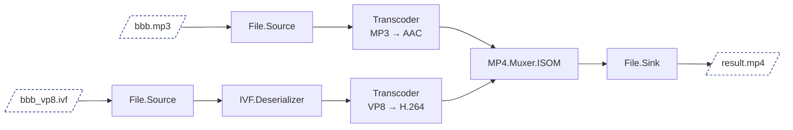

</div>

---
layout: default
---

# Hands-on

<v-clicks>

1. Generate an empty pipeline with `mix membrane.gen.pipeline WorkshopPipeline`.
2. In `handle_init/2`, describe the pipeline from the task and return it as `:spec`.
3. Terminate in `handle_element_end_of_stream/4`.
4. Run it with `mix run run_pipeline.exs`, then open `result.mp4` with `ffplay`.

</v-clicks>

<v-click>

Our solution: `chapter-1-checkpoint`.

<div class="text-xs mt-2">

**Building blocks**

| Package | Component | Kind | What it does |
|---------|-----------|------|--------------|
| `membrane_file_plugin` | `Membrane.File.Source` | Source | Reads chunks of bytes from a file |
| `membrane_ivf_plugin` | `Membrane.IVF.Deserializer` | Filter | Extracts the video stream from an IVF container |
| `membrane_transcoder_plugin` | `Membrane.Transcoder` | Filter | Converts the stream into the format you declare |
| `membrane_mp4_plugin` | `Membrane.MP4.Muxer.ISOM` | Filter | Muxes streams into an MP4 container |
| `membrane_file_plugin` | `Membrane.File.Sink` | Sink | Writes received chunks to a file |

</div>

</v-click>
---
layout: section
routeAlias: chapter-2
---

<span class="chapter-label">Chapter 2</span>

# Raw video processing and custom Elements

Writing your own Filter and plugging it into the pipeline

---
layout: default
---

# What's in this chapter

<v-clicks>

1. **Raw video**: frames, resolution, RGB in memory
2. **Color inversion**
3. **Elements**: pads and callbacks
4. **Buffers**
5. **The task**: your own filter in the middle of the pipeline

</v-clicks>

---
layout: default
---

# Raw video and RGB

A raw video stream is a series of images called **frames**. You get each frame as a binary, exactly as it sits in memory.
To read it you need the **resolution** and the **pixel format**.

<div class="grid grid-cols-2 gap-8 mt-4">
<div v-click>

**Resolution**: pixels are laid out row by row. A pixel at `(x, y)`, with `n` bytes per pixel, starts at:

```
(y * width + x) * n
```

</div>
<div v-click>

**RGB**: three bytes per pixel, one for red, green and blue, each 0 to 255.

```
Resolution: (2, 2)

Bytes in memory:
[1, 2, 3, 4, 5, 6, 7, 8, 9, 10, 11, 12]

Pixels on a frame:
 -----------------
| #010203 #040506 |
| #070809 #101112 |
 -----------------
```

</div>
</div>

---
layout: default
---

# Color inversion

Replace each color of each pixel with its **complementary** value, so that the two sum to 255.

<div class="text-center text-3xl my-6 font-semibold" style="color: var(--membrane-navy)">
inverted = 255 - value
</div>

<v-click>

Adding the negative to the original pixel-wise gives a completely white image.

</v-click>

<v-click>

In RGB every byte is one color value, so inverting a frame is inverting every byte of the binary.

</v-click>

---
layout: default
---

# Elements

<span class="pill light">Reminder</span> The most basic components of a pipeline. Three kinds: **Source** produces, **Sink** consumes, **Filter** does both.

<v-clicks>

- An element is a module implementing the behaviour of its kind: `use Membrane.Source`, `use Membrane.Sink` or `use Membrane.Filter`.
- Two things to define: **pads**, which interface with other components, and **callbacks**, which define behaviour.
- A blank filter:
  ```bash
  mix membrane.gen.filter ColorInverter
  ```

</v-clicks>

---
layout: default
---

# Pads specification

Each pad declares an **accepted format**: a contract about what the element handles.
Only components with matching formats can be linked.

```elixir
def_input_pad :input,
  accepted_format: %Membrane.RawVideo{pixel_format: :RGB}

def_output_pad :output,
  accepted_format: %Membrane.RawVideo{pixel_format: :RGB}
```

<v-click>

This element can only be linked between something producing RGB raw video and something consuming it.

</v-click>

---
layout: default
---

# Buffers and `handle_buffer`

A stream is a sequence of **buffers**. Each `Membrane.Buffer` holds a chunk of the stream in `:payload`. Here: one raw frame.

```elixir {all|2|3-4|6|all}
@impl true
def handle_buffer(:input, %Membrane.Buffer{} = buffer, _ctx, state) do
  inverted_frame = invert_frame(buffer.payload)
  buffer = %Membrane.Buffer{buffer | payload: inverted_frame}

  {[buffer: {:output, buffer}], state}
end
```

<v-clicks at="1">

- called every time a buffer arrives on `:input`
- process the payload and put it back into the buffer
- the `:buffer` action sends it out through `:output`

</v-clicks>

---
layout: default
---

# The task

Create an element that inverts the colors of an RGB raw video stream and plug it into the middle of the pipeline from Chapter 1.

<v-click>

`Transcoder` decodes and encodes internally, so raw video is never exposed. Split it into two and put `ColorInverter` in between:

<div class="flex justify-center">

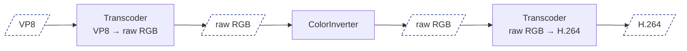

</div>

</v-click>

---
layout: default
---

# Hands-on

<v-clicks>

1. Generate the filter and define both pads with the RGB accepted format.
   ```bash
   mix membrane.gen.filter ColorInverter
   ```
2. Implement `handle_buffer/4` to perform frame color inversion.
3. In the pipeline, replace the video `Transcoder` with two, the first one outputting
   ```elixir
   %Membrane.Transcoder.OutputFormat.RawVideo{pixel_format: :RGB}
   ```
   and link `ColorInverter` between them.
4. Run it and check `result.mp4`.
   ```bash
   mix run run_pipeline.exs && ffplay result.mp4
   ```

</v-clicks>

<v-click>

<div class="mt-4">

Our solution: `chapter-2-checkpoint`.

</div>

</v-click>

---
layout: section
routeAlias: chapter-3
---

<span class="chapter-label">Chapter 3</span>

# Timestamps and flow control

Playing in real time and switching between streams

---
layout: default
---

# What's in this chapter

<v-clicks>

1. **Timestamps**: PTS, DTS, where they come from
2. **Offline vs online** processing and the Realtimer
3. **Flow control**: backpressure, demands, the three modes
4. **The tasks**: real-time playback, ad insertion, audio

</v-clicks>

---
layout: default
---

# Timestamps

Each `Membrane.Buffer` can carry two timestamps, both expressed with `Membrane.Time`:

<v-clicks>

- **PTS**, presentation timestamp, in `pts`: when to *present* this chunk
- **DTS**, decoding timestamp, in `dts`: when to *decode* this chunk

</v-clicks>

<v-click>

DTS is always strictly increasing. PTS may equal DTS, but not with **B-frames**: a frame encoded relative to frames presented both before and after it has to be decoded earlier than it is presented.

</v-click>

---
layout: default
---

# Where timestamps come from

<v-clicks>

- Usually from the **container**. A plain H.264 stream has none, an MP4 has them for every sample. So right after `File.Source` there are none, they appear after demuxing.
- With a **constant rate** they can be restored: each chunk has a known duration, the timestamp is the sum of the durations before it. The offset of the whole stream is lost, so it starts from zero.
  - Audio has a constant sampling rate by nature: `Membrane.RawAudioParser` with `overwrite_pts?: true` counts samples and sets `pts`.
  - Video only if the frame rate is constant: `Membrane.H264.Parser` calls its option to restore timestamps `generate_best_effort_timestamps` for a reason.

</v-clicks>

---
layout: default
---

# Offline and online processing

<div class="grid grid-cols-2 gap-8 mt-2">
<div v-click>

**Offline**

Transcode a file into another file. Timestamps are carried along, but nothing waits for them. As fast as possible.

</div>
<div v-click>

**Online**

Display to a user or send to a peer. Each chunk has to be delivered when its timestamp says.

</div>
</div>

<v-click>

<div class="mt-6">

A camera paces itself. A file can be read far faster than it should be played, so the stream has to be slowed down to real time based on its timestamps.

`Membrane.Realtimer` holds every buffer until its timestamp comes and only then passes it on.

</div>

</v-click>

---
layout: default
---

# Flow control

Every element is a process with its own mailbox. A fast producer feeding a slow consumer without limits fills the memory with waiting buffers.

<v-clicks>

- The **slowest** element should dictate the pace, not the fastest.
- The consumer telling the producer how much it can take is **backpressure**. Membrane implements it with **demands**.
- Configured per pad with the `flow_control` option of `def_input_pad` and `def_output_pad`.

</v-clicks>

---
layout: default
---

# Three flow control modes

<div class="grid grid-cols-3 gap-6 mt-4">
<div v-click>

**`:auto`** (default)

The framework computes the demand from the neighbours and the element's own pace. You only implement `handle_buffer`.

</div>
<div v-click>

**`:push`**

No backpressure. Output sends whenever it wants, input has to keep up. For pace dictated from outside, like network packets.

</div>
<div v-click>

**`:manual`**

Pull mode. Nothing arrives on an input until the element demands it with a `:demand` action. Output demand is handled by the element in `handle_demand`.

</div>
</div>

<v-click>

<div class="mt-6">

`:auto` and `:push` are nearly interchangeable from the code's point of view. `:manual` requires implementing `handle_demand/5` and returning `:demand` actions.

</div>

</v-click>

---
layout: default
---

# Manual flow control

```elixir {all|4-5|7-10|12-15|all}
defmodule PassThrough do
  use Membrane.Filter

  def_input_pad :input, accepted_format: _any, flow_control: :manual, demand_unit: :buffers
  def_output_pad :output, accepted_format: _any, flow_control: :manual

  @impl true
  def handle_demand(:output, size, :buffers, _ctx, state) do
    {[demand: {:input, size}], state}
  end

  @impl true
  def handle_buffer(:input, buffer, _ctx, state) do
    {[buffer: {:output, buffer}], state}
  end
end
```

<v-clicks at="1">

- both pads manual, input demand counted in buffers
- downstream asks for `size` buffers, the filter asks upstream for the same
- each buffer is passed on. When downstream wants more, `handle_demand/5` is called again

</v-clicks>

---
layout: default
---

# Demand and redemand

<v-clicks>

- `:demand` **overwrites** the current demand, it does not add to it.
- You are guaranteed not to receive more than you demanded.
- You are expected to satisfy the whole demand on your output. If you dropped some buffers, return `redemand: :output`: `handle_demand/5` is called again with the updated demand.

</v-clicks>

<v-click>

```elixir
@impl true
def handle_buffer(:input, buffer, _ctx, %{counter: counter} = state) do
  actions =
    if rem(counter, 2) == 0,
      do: [buffer: {:output, buffer}],
      else: [redemand: :output]

  {actions, %{state | counter: counter + 1}}
end
```

</v-click>

---
layout: default
---

# Task 3.1: play the video in real time

Drop the audio branch and the MP4 muxing. The output of `ColorInverter` ends up in `Membrane.SDL.Player`, played at natural speed.

<div class="flex justify-center">

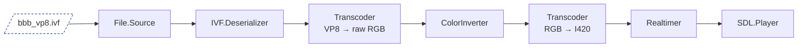

</div>

<v-clicks>

- The window should show the color-inverted Big Buck Bunny at 25 frames per second.
- The pipeline terminates on its own when the video finishes.

</v-clicks>

---
layout: default
---

# Hands-on 3.1

<v-clicks>

- The player accepts only `I420` (planar YUV 4:2:0, another raw pixel format, different from RGB), so put a `Transcoder` with `%RawVideo{pixel_format: :I420}` between `ColorInverter` and the player.
- The `Realtimer` goes right before the player, so everything before it can work ahead of time.
- Terminate when the player reports end of stream.
- Run it with `mix run run_pipeline.exs`.

</v-clicks>

<v-click>

<div class="text-xs mt-2">

**Building blocks**

| Package | Component | Kind | What it does |
|---------|-----------|------|--------------|
| `membrane_realtimer_plugin` | `Membrane.Realtimer` | Filter | Holds every buffer until its timestamp is reached. The first buffer's timestamp is the starting point |
| `membrane_sdl_plugin` | `Membrane.SDL.Player` | Sink | Opens a window and draws raw video frames. Accepts only `I420` |

</div>

</v-click>
---
layout: default
---

# Task 3.2: insert an ad

Write a `StreamSwitcher` filter with `:main` and `:ad` inputs, one `:output`, and a `switch_time` option. The ad is `assets/ad_vp8.ivf`, same format as the main video.

<div class="flex justify-center">

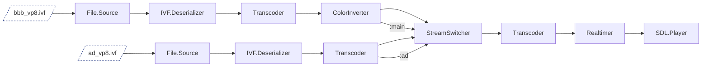

</div>

<v-clicks>

1. forward `:main` up to and including the first buffer with `pts >= switch_time`
2. forward `:ad` until it ends
3. forward `:main` again from where it was paused
4. shift timestamps so the output timeline stays continuous
5. end the output only when both inputs have ended

</v-clicks>

---
layout: default
---

# Hands-on 3.2

No new building blocks, the switcher is yours to write.

```bash
mix membrane.gen.filter StreamSwitcher
```

<v-clicks>

- All pads `flow_control: :manual`. Keep the **active** input in the state and demand from it only.
- Demand **one buffer** at a time, so you always know which pad the next one comes from.
- Return `redemand: :output` with every buffer you send and whenever the active pad changes.
- Compare each `:main` buffer's `pts` with `switch_time`. Forward it, then mark `:ad` as active.
- Keep the last timestamp you sent. At each switch compute an offset for the new segment, for `dts` too.
- `handle_end_of_stream/3` is called per input pad. The default forwards it immediately, so implement it and track which inputs have ended.
- Forward the first stream format you receive, the other input carries the same kind of stream.

</v-clicks>

---
layout: default
---

# Task 3.3: bring the audio back

Play `assets/bbb.mp3` through the speakers and insert `assets/ad.mp3` with a second `StreamSwitcher`, same `switch_time`.

<div class="flex justify-center">

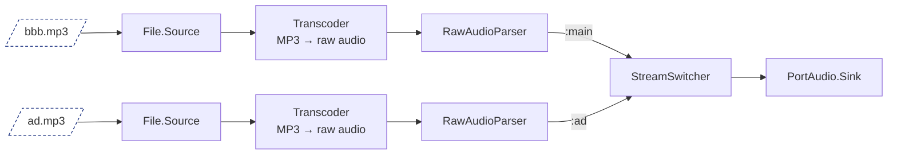

</div>

<v-clicks>

- The main audio stops when the ad appears on screen and comes back once it ends.
- The pipeline terminates only after both video and audio have finished.

</v-clicks>

---
layout: default
---

# Hands-on 3.3

<v-clicks>

- The audio and video branches are not connected at all. They only share the `switch_time`.
- MP3 carries no timestamps: `RawAudioParser` with `overwrite_pts?: true` in both branches, between the decoder and the switcher.
- Both decoders must output the same format: `%RawAudio{sample_format: :s16le, sample_rate: 44_100, channels: 2}`.

</v-clicks>

<v-click>

Our solution: `chapter-3-checkpoint`.

<div class="text-xs mt-2">

**Building blocks**

| Package | Component | Kind | What it does |
|---------|-----------|------|--------------|
| `membrane_portaudio_plugin` | `Membrane.PortAudio.Sink` | Sink | Plays raw audio through the default audio device |
| `membrane_raw_audio_parser_plugin` | `Membrane.RawAudioParser` | Filter | Computes timestamps of raw audio buffers from their size and format |

</div>

</v-click>
---
layout: section
routeAlias: chapter-4
---

<span class="chapter-label">Chapter 4</span>

# Real-time streaming with WebRTC

From a file on disk to a browser tab

---
layout: default
---

# What's in this chapter

<v-clicks>

1. **WebRTC**: signaling and connection
2. **Bins**: reusing a piece of a pipeline as one component
3. **Boombox**
4. **The task**: the pipeline's output in a browser tab

</v-clicks>

---
layout: default
---

# WebRTC

Web Real-Time Communication: a set of protocols that lets two peers, usually browsers, send audio and video to each other with very low delay.
A Membrane pipeline can be one of the peers.

<div class="grid grid-cols-2 gap-8 mt-4">
<div v-click>

**Signaling**

The peers agree on what they send, in which codecs, and how to reach each other: an **SDP offer**, an **SDP answer** and **ICE candidates**.
The standard doesn't say how these messages travel. Here: a WebSocket between the browser and the pipeline.

</div>
<div v-click>

**Connection**

Once the peers know each other's addresses, they set up an encrypted connection and send media over it in small packets: **RTP**.

</div>
</div>

---
layout: default
---

# Bins

A `Membrane.Bin` is a group of elements, and possibly other bins, packed into a single component.

<div class="grid grid-cols-2 gap-8 mt-4">
<div v-click>

**From the outside**

Looks like an element: it has pads and you link it in the spec the same way.

</div>
<div v-click>

**On the inside**

Has its own children and its own spec, just like a pipeline.

</div>
</div>

<v-click>

<div class="mt-6">

Bins are the way to reuse a piece of a pipeline as a whole.

</div>

</v-click>

---
layout: default
---

# Boombox

A tool built on top of Membrane for moving media between formats and protocols: files, HLS, RTMP, RTSP, WebRTC and more.
`Boombox.Bin` is a bin: you tell it where the media comes from or goes to, and it builds the right chain of elements inside.

<v-clicks>

- With `:output` set, it is a **sink**: link its `:input` pads. With `:input` set, it is a **source**: link its `:output` pads.
- Both pads are **dynamic**, created when linked. One for audio and one for video, chosen with the `:kind` pad option.
- A WebRTC endpoint is `{:webrtc, url}`. With a `ws://` URL, Boombox starts a WebSocket server on that port and waits for a browser to connect.
- It has a `Transcoder` inside, so it accepts raw video in any pixel format and raw audio. It also paces a non-live stream itself.

</v-clicks>

<v-click>

```elixir
child(:my_video_source, MyVideoSource)
|> via_in(:input, options: [kind: :video])
|> child(:boombox, %Boombox.Bin{output: {:webrtc, "ws://localhost:8830"}})
```

</v-click>

---
layout: default
---

# Child notifications

Notifications are how children talk to the pipeline. They arrive in `handle_child_notification/4` together with the child's name.

```elixir
@impl true
def handle_child_notification(:processing_finished, :webrtc_output, _ctx, state) do
  {[terminate: :normal], state}
end

@impl true
def handle_child_notification(_notification, _child, _ctx, state) do
  {[], state}
end
```

<v-click>

`handle_element_end_of_stream/4` is no longer the right place: the sinks it was watching are gone.

</v-click>

---
layout: default
---

# The task

Play the output of the pipeline from Chapter 3 in the browser instead of the SDL window and the speakers.

<div class="flex justify-center">

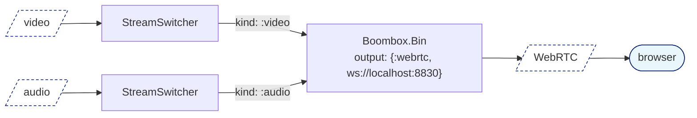

</div>

<v-clicks>

- The browser shows the color-inverted Big Buck Bunny with sound, and the ad after 15 seconds.
- The pipeline terminates when Boombox reports it has finished.

</v-clicks>

---
layout: default
---

# Hands-on: the web page

<v-clicks>

- The browser side needs some JavaScript to do the WebRTC signaling and play the stream. It's already written: `assets/webrtc_to_browser.html`, taken from the Boombox repository. It connects to `ws://localhost:8830` and plays what it receives.
- The page has to be served over HTTP. `AssetsServer` from `lib/assets_server.ex` does that for the `assets/` directory. Start it in `lib/goatmire_2026_workshop/application.ex`:
  ```elixir
  children = [{AssetsServer, port: 8000}]
  ```
- The page is then available at `http://localhost:8000/webrtc_to_browser.html`.

</v-clicks>

---
layout: default
---

# Hands-on: the pipeline

<v-clicks>

1. Remove `SDL.Player`, `PortAudio.Sink` and everything that was there only for them, including the pixel format converter and the `Realtimer`.
2. Link both switchers to one `Boombox.Bin` with a WebRTC output: the first branch creates it, the second refers to it with `get_child/1`. Set the `:kind` pad option on each link.
3. `Boombox.Bin` sends the `:processing_finished` child notification when done. Handle it in `handle_child_notification/4` and terminate there.
4. Run it with `mix run run_pipeline.exs`. It waits for a browser, so open the page, click *Connect* and unmute the player.

</v-clicks>

<v-click>

Our solution: `chapter-4-checkpoint`.

<div class="text-xs mt-2">

**Building blocks**

| Package | Component | Kind | What it does |
|---------|-----------|------|--------------|
| `boombox` | `Boombox.Bin` | Bin | A sink or a source, depending on which option is set |

</div>

</v-click>

---
layout: end
---

# Thank you

membrane.stream · github.com/membraneframework


